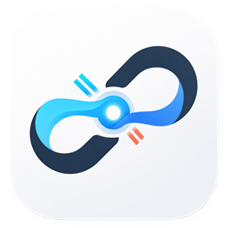

  
  <h1>Termous</h1>
  
<strong>A modern SSH workstation for server management</strong>

  

    <a href="./README.md">简体中文</a>
    ·
    <a href="https://github.com/Countra/termous/releases">Download</a>
    ·
    <a href="./docs/CHANGELOG.md">Changelog</a>
    ·
    <a href="https://github.com/Countra/termous/issues">Issues</a>
  

  

    
    
    
  

Termous brings SSH connections, hosts and credentials, remote files, server operations, network forwarding, and reusable commands into one desktop workstation. It is designed for developers and operators who move between many servers, keeping terminals, file locations, and host state clearly connected while reducing context switching and mistakes.

## Why Termous

| Problem | How Termous Helps |
| --- | --- |
| Hosts, credentials, terminals, and file tools are scattered | Manage connections, files, and remote operations in one workstation |
| Complex networks require several connection tools | Configure a jump host or HTTP / SOCKS5 proxy per host and share the route across SSH, SFTP, and forwarding |
| Multiple SSH sessions are hard to track | Keep context clear with tabs, colors, pinning, duplication, and split panes |
| Terminals and remote files require constant switching | Use SFTP, directory following, bookmarks, and the workstation file panel in the same session |
| The same diagnostics must run on several servers | Send once to the current, selected, or all connected sessions and review each result separately |
| Common commands and server actions are repeated | Reduce repetitive work with snippets, command aliases, scheduled tasks, and remote operations panels |

## Quick start

1. Download the installer or AppImage for your platform from [Releases](https://github.com/Countra/termous/releases).
2. Open Termous and add a credential and host. Configure a jump host or connection proxy when needed.
3. Click "Connect" in the top bar and choose the target host to enter the SSH workstation.
4. Use the right-side workspace for files, system information, monitoring, processes, services, Docker, firewall, scheduled tasks, port forwarding, aliases, and snippets.
5. Open the session command console from the terminal status bar when you need to work with several connected sessions.
6. Use the standalone "Files" page for a larger workspace for remote directories and transfers.

## Highlights

### SSH workstation

- Multiple session tabs with duplication, renaming, pinning, and color labels.
- Terminal split panes with draggable proportions for logs, commands, and environment comparisons.
- The bottom session command console can run a single-line shell command across the current, selected, or all connected SSH sessions, with output and available exit codes shown per session.
- Interrupt one or all targets. Collapsing the console does not interrupt a task, and its height can be adjusted by dragging.
- Context-aware smart completion combines Termous-managed aliases, safe single-line snippets, remote command history, current-directory suggestions, and Bash commands. Each source can be enabled or disabled independently.
- Completion inserts a candidate without executing it; Tab always remains available for the remote shell's native completion.
- Terminal search and a context-aware menu for copy, find, paste, opening supported HTTP/HTTPS links, and locating remote paths in the workstation file panel.
- Bidirectional directory following between the terminal and workstation file panel, with compact remote bookmarks.
- Local PowerShell / CMD sessions on Windows.
- Terminal font, size, line height, letter spacing, cursor, and theme settings, plus an SSH-terminal smooth scrolling option.

### Hosts, credentials, and connection proxies

- Host groups, tags, favorites, recent hosts, and latency checks.
- Password and private-key authentication, including encrypted private keys associated with passphrase credentials.
- The host icon library supports batch import, preview, search, renaming, and drag reordering. Icons in use cannot be deleted.
- Hosts support notes, jump hosts, platform information, and individual connection proxy settings.
- Per-host unauthenticated HTTP or SOCKS5 proxies, with no automatic direct fallback after a proxy failure.
- One host-key trust flow shared by SSH, jump hosts, SFTP, and port forwarding.
- Credentials are managed separately from hosts to avoid repeating sensitive data.

### Remote files and directory following

- Multi-session SFTP file management.
- Upload, download, move, delete, rename, and permission management.
- Drag uploads into the current directory or a specific folder.
- Remote bookmarks, local download locations, and a transfer list with live progress.
- Online text file editing and image preview.
- Bidirectional directory sync between the terminal and workstation file panel, with the last successful directory preserved and manual recovery available after a disconnect.

### Server operations

- Linux system information.
- Overall CPU trends and live per-core usage, plus memory, network, and disk monitoring.
- Linux process browsing, search, and termination.
- systemd service state, controls, and logs.
- Docker container state, controls, details, and logs.
- iptables / nftables firewall rule management and persistence assistance.
- Scheduled task (Crontab) management for the current SSH user, with common schedules, Cron expressions, and an advanced raw Crontab editor. It switches to read-only when the server can read but cannot safely update the task list, and clearly reports missing permissions or concurrent edit conflicts.

### Commands and networking

- Reusable snippets with groups, variables, and send-to-session actions.
- Termous-managed aliases for Bash, Zsh, and Fish, with serial synchronization of selected aliases to multiple configured hosts.
- Synchronization shows progress and results per host, skips shell mismatches, and supports cancellation or reopening an active task.
- Local forwarding, remote forwarding, and dynamic proxy.
- Running forwards expose connection counts, cumulative traffic, live send/receive rates, restart, and stop actions.

### Data, security, and desktop experience

- Custom desktop window, tray menu, and minimize to tray.
- Dark and light themes.
- Shortcut settings can search actions, record keys, detect conflicts, and restore defaults for common terminal, smart completion, file list, and remote editor actions.
- In-app update checks, downloads, and installation.
- Encrypted `.tobp` backups with full, merge, and selective restore modes.
- Connection cleanup reminder before closing.
- Simplified Chinese and English UI.

## Use cases

- Log in to multiple Linux servers during daily work.
- Switch frequently between SSH sessions and remote files.
- Monitor resources, manage processes and services, read configuration files, and run diagnostics.
- Run one-off diagnostics across connected servers and compare output and available exit codes in one place.
- Manage recurring tasks for the current SSH user or synchronize the same managed aliases across hosts using the same Shell family.
- Create temporary port forwards or proxy channels.
- Save common server commands as reusable snippets or remote Shell aliases.

## Security and privacy

Termous is a desktop workstation that runs locally. Credentials are kept in secure storage on the device, and SSH host identity is verified through a unified fingerprint trust flow. Encrypted backups do not export the device's master key, and downloaded updates are verified before installation.

- Connection proxies accept only unauthenticated HTTP and SOCKS5 endpoints so proxy credentials do not enter host configuration, logs, or backups.
- The session command console sends only to SSH sessions confirmed at an idle prompt and locks their terminal input while a task runs. Command text and results are not written to the database, backups, or logs.
- Smart completion keeps a limited amount of remote history and directory index data only in memory for the current SSH session. It is released when the session closes and is not persisted to local data, backups, or logs.
- When a scheduled task has concurrent changes or an uncertain write result, Termous stops and reports the issue instead of overwriting the existing configuration.
- Alias synchronization follows existing credential, proxy, jump-host, and host-fingerprint trust settings, and validates configuration before writing.

## Platform support

- Windows x64: `.exe` installer
- macOS x64 / arm64: `.dmg` and `.zip`
- Linux x64: `.AppImage`

Windows is the primary supported platform; the macOS and Linux experience continues to improve.

## Help and support

- Read the [changelog](./docs/CHANGELOG.md) for release updates.
- Use [GitHub Issues](https://github.com/Countra/termous/issues) to report problems or suggest improvements.
