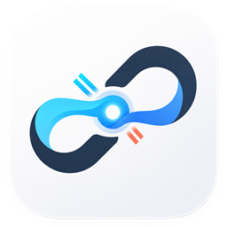

  
  <h1>Termous</h1>
  
<strong>面向服务器管理的现代化 SSH 工作站</strong>

  

    <a href="./README.en.md">English</a>
    ·
    <a href="https://github.com/Countra/termous/releases">下载</a>
    ·
    <a href="./docs/CHANGELOG.md">更新日志</a>
    ·
    <a href="https://github.com/Countra/termous/issues">反馈问题</a>
  

  

    
    
    
  

Termous 将 SSH 终端、VNC 远程桌面、主机与凭据、多协议文件管理与本机挂载、服务器运维和 AI 助手集中到一个桌面工作站。它适合需要频繁切换多台服务器的开发者与运维人员，让连接、文件和任务保持清晰关联，也可通过 MCP 与外部 AI 工具协作。

## 为什么选择 Termous

| 痛点 | Termous 的解决方式 |
| --- | --- |
| 主机、凭据、终端和文件工具分散 | 在一个工作站内统一管理连接、文件与远程运维操作 |
| 同一主机有多个账号或访问方式 | 分别保存 SSH、文件和远程桌面配置，连接时选择需要的方式 |
| 文件分散在服务器、对象存储和共享目录 | 统一管理 SFTP、S3／MinIO、WebDAV、FTP／FTPS 和 SMB，也可挂载到本机访问 |
| 复杂网络环境需要多套连接工具 | 为 SSH 连接配置跳板机或 HTTP / SOCKS5 代理，并让关联的 SFTP 和转发沿用连接链路 |
| 多个 SSH 会话容易混乱 | 通过会话标签、颜色、固定、复制和分屏保持清晰上下文 |
| 终端与远程文件来回切换 | 通过 SFTP、目录跟随、书签和工作站文件区在同一会话内协同操作 |
| 多台服务器重复执行诊断命令 | 通过会话命令台一次发送到当前、指定或全部已连接会话，并分别查看结果 |
| 常用命令和服务器操作重复 | 使用代码片段、命令别名、定时任务和远程运维面板减少重复操作 |
| 排查问题需要在 AI 工具与服务器间反复复制信息 | 从会话标签关联 SSH 或文件连接，将终端选区发送给内置 AI 助手，或通过 MCP 授权外部 AI 工具访问 |

## 快速开始

1. 从 [Releases](https://github.com/Countra/termous/releases) 下载适合当前平台的安装包或 AppImage。
2. 在“主机”页填写主机信息，可同时配置 SSH／远程桌面，也可先保存无连接主机。保存后在“连接配置”中添加所需文件引擎；SFTP 关联 SSH 配置，其他文件引擎独立填写连接信息。
3. 点击顶部的“连接”，选择主机和具体连接配置，打开终端、文件或远程桌面。
4. SSH 工作站右侧提供文件、监控、进程、服务、Docker、防火墙等工具；底部“会话命令台”可向多个已连接会话发送命令。独立“文件”页适合处理目录、搜索和传输。
5. 使用 AI 助手前，按首次准备提示完成设置，在“设置 → AI 助手”添加模型提供商并选择模型。右键终端或文件会话标签，选择“交给 AI 助手”，可关联到新会话或搜索已有会话；关联完成后自行输入问题。需要接入外部 AI 工具时，在“设置 → MCP”创建客户端并复制连接配置。
6. 如需通过资源管理器或其他本机程序访问远端文件，在挂载页选择文件配置，检查驱动环境并指定盘符或空目录；可在“设置 → 挂载”管理本地缓存。
7. 可随时重新打开功能向导，了解连接、文件管理、挂载、缓存、审计及 Skills 安装。

## 功能亮点

### SSH 工作站

- 多会话标签支持复制、重命名、固定和颜色标记。
- 支持终端分屏和拖拽调整比例，适合并行查看日志、执行命令和对比环境。
- 底部会话命令台可将单行 Shell 命令并行发送到当前、指定或全部已连接 SSH 会话，并按会话展示输出和可用的退出码。
- 支持中断单个或全部目标；折叠命令台不会中断任务，面板高度也可拖动调整。
- 支持上下文感知的智能补全，聚合 Termous 管理的命令别名、安全单行代码片段、远端命令历史、当前目录候选和 Bash 命令，各来源可独立启停。
- 智能补全只插入候选，不自动执行命令；Tab 始终保留给远端 Shell 的原生补全。
- 可选 AI 命令补全支持用自然语言描述需求，使用 AI 设置中的默认模型生成单行命令和说明；候选可复制或填入终端，支持继续生成和取消。此功能默认关闭，需在终端设置中开启，填入后由用户确认执行。
- 支持终端搜索和上下文感知右键菜单，可复制、查找、粘贴、打开受支持的 HTTP/HTTPS 链接或在工作站文件区定位远程路径。
- 工作站文件区可与终端双向跟随目录，并提供紧凑的远程目录书签入口。
- Windows 支持本地 PowerShell / CMD 会话。
- 支持终端字体、字号、行高、字符间距、光标和主题设置，并可单独开启或关闭 SSH 终端平滑滚动。

### 主机与连接配置

- 主机分组、标签、收藏、最近使用，以及 SSH 连接的连通性与延迟检测。
- 同一主机可保存多套 SSH、文件和远程桌面配置，并分别选择默认连接；S3、WebDAV、FTP 和 SMB 文件配置无需 SSH。
- 主机可以独立创建，也可仅配置远程桌面；新建时在主机设置与连接配置之间切换不会提前保存。
- SSH 支持密码和私钥认证，可导入加密私钥并关联口令凭据。
- 主机图标库支持批量导入、预览、搜索选择、改名和拖拽排序；正在使用的图标不可删除。
- 主机支持备注、平台信息和图标；各 SSH 连接可分别选择账号、跳板连接和代理。
- 支持无认证的 HTTP 或 SOCKS5 连接代理；连接失败不会自动回退直连。
- SSH、跳板机、SFTP 和端口转发使用统一的主机指纹信任流程。
- 凭据与主机分离管理，避免在多个主机配置中重复维护敏感信息。

### VNC 远程桌面

- 在独立远程桌面工作区连接和切换桌面会话。
- 支持通过 SSH 隧道连接，也可直接连接目标 IP；仅使用直连桌面时无需配置 SSH。
- 可保存 VNC 连接密码，使用全屏、画质调整和断线重连。
- 目前支持 VNC 协议，不包含 RDP 协议支持。

### 多协议文件管理与目录跟随

- 支持 SFTP、S3／MinIO、WebDAV、FTP／FTPS 和 SMB，多会话共用文件管理、文本编辑、图片预览与传输入口。
- FTP 支持明文、显式 TLS 和隐式 TLS；SMB 使用 NTLMv2 账号密码，支持可选域和共享内工作区目录，无需安装系统 SMB 客户端。
- 支持上传、下载、移动、删除和重命名；权限设置、批量改名和搜索等操作按当前引擎能力开放。
- 支持拖拽上传到当前目录或指定文件夹，同名冲突可逐项选择覆盖。
- 可跨文件连接和存储引擎复制文件与目录，包括同一主机的其他独立文件会话；支持批量分发、目标目录选择、进度查看和取消，并分别展示各目标的完成情况。
- 高级批量重命名支持规则组合、结果预览、同名冲突检查和常用预设。
- Linux 远程文件名搜索支持指定目录、文字／通配符／正则匹配和筛选，搜索结果可直接定位；缺少所需组件时提供安装指引。
- 支持远程目录书签、本地下载位置和带实时进度的传输列表；目录详情可按能力计算总大小，并支持取消和重新计算。
- 支持文本文件在线编辑和图片文件在线预览。
- 支持复制远端文件路径，MCP 发起的文件会话与传输会标明来源。
- 关联 SSH 的 SFTP 文件区可与终端双向同步当前目录；断线后保留最后成功目录并提供手动恢复。

### 本机挂载与缓存

- 将文件配置挂载为 Windows 盘符或 macOS／Linux 目录，支持临时挂载、保存配置、只读访问、自动启动、同步、重连和卸载。失败项按资源保留状态提供重启、关闭或恢复操作。
- 同一文件配置允许多个只读挂载，最多一个可写挂载。Windows 需要 WinFsp 2.1+，Linux 需要 FUSE3，macOS 需要 macFUSE 及系统批准；页面提供环境诊断，安装包不捆绑这些系统驱动。
- 内容按需下载到本地磁盘缓存；相同连接身份和远端版本下，已验证内容可在重新挂载及 Core 重启后复用。FTP 等服务端不支持范围读取时，打开大文件可能回退完整下载。
- 顺序写入可边缓存边上传，并根据传输进展限制本地领先量；复杂随机修改或不支持流式上传时采用兼容写回。页面显示已接收、已传输和待传输量，并区分正文传输与最终发布。
- 系统复制窗口结束不一定代表远端已经完成刷新、对象提交或替换。普通同挂载复制经本机读写搬运数据，不保证使用服务端复制；S3 改名／移动采用复制后删除，耗时受服务端影响且不是原子操作。
- “设置 → 挂载”可调整缓存目录、总容量和磁盘预留空间，查看占用并清理未使用缓存；修改在下次 Core 启动生效。缓存不提供离线访问，也不恢复崩溃前未发布的修改。
- 正常退出、更新和配置恢复前会协调同步；失败时保留错误，可重试、返回应用或明确放弃修改。挂载不面向数据库、虚拟机磁盘等依赖完整本地文件系统语义的场景。

### 服务器运维

- Linux 系统信息展示。
- CPU 总体趋势与逐核心实时使用率，以及内存、网络和磁盘监控。
- Linux 进程查看、搜索与终止。
- systemd 服务状态、控制和日志查看。
- Docker 容器状态、控制、详情和日志查看。
- iptables / nftables 防火墙规则管理与持久化辅助。
- 支持管理当前 SSH 用户的定时任务（Crontab），可使用常用计划、Cron 表达式或高级 Crontab 原文编辑；服务器可读取但无法安全写入时自动切换为只读，没有管理权限或发生并发修改时会明确提示。

### 命令与网络工具

- 常用代码片段支持分组、变量和发送到当前会话。
- 支持管理 Bash、Zsh 和 Fish 的 Termous 受管命令别名，并可将选中的别名串行同步到多个已配置主机。
- 同步过程按主机展示进度与结果；目标 Shell 不匹配时自动跳过，并支持取消或重新打开活动任务。
- 支持本地端口转发、远程端口转发和动态代理。
- 运行中的转发可查看连接数、累计流量和实时发送/接收速率，并支持重启和停止。
- 已保存的转发可开启随 Core 启动自动连接，默认关闭；首次连接失败会展示原因，不自动重试。
- 连接设置支持 SSH 保活与后台端口转发自动恢复，可查看重试进度或主动停止恢复。

### AI 助手

- 接入自定义模型服务，管理模型目录，并按会话选择模型和运行参数；需要自行配置可用的模型服务。
- 实时查看回复、思考过程、工具执行与审批进度，支持停止任务。
- 模型请求遇到临时故障时最多自动重试 3 次，并显示重连状态和错误原因。回答中途断开会保留已输出内容，重新生成当前回答；此前已完成的工具操作不会因重试重复执行。
- 支持文本、图片附件和粘贴图片。终端选区可通过右键菜单发送到新建或指定的 AI 会话，选中文字作为附件保留来源信息。
- 终端和文件会话标签的“交给 AI 助手”支持搜索已有会话及识别置顶项。纯连接转交只建立引用，不预填文字、不自动发送问题，也不覆盖已有草稿。
- 每个 AI 会话最多同时关联一个 SSH 会话和一个文件配置；同类替换需确认，两类可分别查看、更换或解除，解除后保留草稿、附件和历史消息。
- 在输入框开头或已有正文的 ASCII 空格后直接键入 `/`，可打开 Renderer 本地 Slash 命令列表：`/session` 关联现有的就绪 SSH 会话，或关联文件会话对应的文件配置；`/profile` 选择保存的 SSH／文件配置，文件配置直接绑定，SSH 配置默认只关联 Profile，开启 Agent 设置中的“关联时自动连接”后才异步建立连接；`/compact` 预约下一条新提交消息在发送前整理上下文，不改变已排队消息。该 SSH Profile 设置统一作用于 Slash 选择和资源卡换绑，`/session` 的精确会话关联不受影响。列表支持方向键、Enter 和逐级 Esc；命令仅在业务受理后于本地消费，不调用 MCP Tool 或 Skill，也不会进入模型提示词。
- SSH 引用失效后，可在引用卡片详情中“恢复连接”，按原 SSH 配置建立新连接，就绪后更新当前引用。支持主机信任确认、取消和失败重试；已有排队消息会保留并暂停，恢复结束后需手动继续队列，不会重放历史命令。
- 文件引用按保存的文件配置生效，助手通过自己的文件会话操作；原文件标签关闭或断开不影响引用。配置被删除或归属失效时，可更换或解除引用。
- 运行期间可继续追加消息，对待处理消息排序、编辑或选择立即执行。
- 会话支持重命名、分组、置顶、搜索、拖动排序、归档查看与恢复；手动顺序不会因新消息改变。
- 长对话可自动整理上下文，默认阈值为 80%，可调整为 50%–95%，也可预约下次发送前整理上下文。完整聊天记录保留，并展示整理状态、前后占用与耗时。
- 输入框可回看最近 10 条输入，编辑或多行输入时保留上下键的光标操作；消息可复制 Markdown 内容，并显示日期、回复耗时和 Token 用量。
- 上下文占用与累计 Token 用量分别展示。切换模型后若尚未评估，会保留上次用量供参考，在后续发送时更新。

### MCP 与外部 AI 工具

- 在“设置 → MCP”管理服务和客户端，为不同工具分别授权、重新生成令牌或删除访问权限。
- 支持 SSH 命令、系统与进程管理、systemd、Docker、定时任务、文件管理、端口转发和代码片段。
- 文件管理工具统一使用 `termous.files.*`，权限使用 `files:*`；旧客户端配置自动迁移，外部工具调用需使用新名称。
- 文件删除使用独立的 `files:delete` 权限，先预览范围再按客户端审批策略执行，支持异步任务、逐项结果查询和取消；已有外部客户端不会因升级自动获得删除权限。
- 可逐次审批操作，或为可信客户端开启无需逐次审批；主机指纹确认与已授予的权限仍然有效。
- 连接外部工具时使用设置页提供的地址与客户端令牌，并保持 Termous 运行；应用重启后连接地址可能变化，需要以设置页为准。
- [Termous Skills](https://github.com/Countra/termous-skills) 提供配套工作流，内置 AI 助手已随应用提供这些技能。在“设置 → MCP → 授权客户端”点击“安装 Skills”，选择客户端类型和项目目录或用户主目录：Codex 安装至其下的 `.agents/skills`，Claude Code 安装至 `.claude/skills`；自定义类型直接安装至所选目录。安装前会显示最终路径和同名项，默认跳过已有 Skill，勾选替换后才覆盖整个同名文件夹。MCP 连接及权限仍需单独配置。

### 消息中心与系统通知

- 顶部铃铛打开消息抽屉，查看 AI 助手和文件上传、下载、复制、移动的正式结果；支持未读筛选、按来源筛选、已读和清理。会话展示标题及限长概览，文件展示名称、完成数量和传输量。
- 历史保存最近 30 天、最多 1000 条。主动取消不产生完成提醒，挂载读写不接入。
- 桌面版仅在最小化或隐藏到托盘时弹系统通知；AI 助手队列在收口时提醒，MCP 文件任务默认不单独提醒。
- 命令、文件、远程管理、转发和片段等待审批操作单独提醒，点击定位现有审批窗口；已处理、过期或取消的审批提醒自动移除。
- 通用设置可关闭全部或分类系统通知，不影响历史收录。点击可定位原会话、传输记录或查看保留摘要；实际投递遵循操作系统设置。
- 实现与边界见[消息中心架构](./docs/notification-center.md)。

### 审计中心

- 集中查看内置 AI 助手和外部 MCP 客户端的工具调用、审批与后台任务结果；支持组合筛选、关键词搜索、详情和关联事件查看。
- 记录在本机独立保存，默认保留 90 天；在“设置 → 审计”中配置采集总开关、最长保留天数及最多保留条数，超限旧记录后台清理。关闭采集后仍可查询历史。
- 不记录普通手动操作，日志和本机审计策略不随配置备份导出。
- 命令执行审计保留命令原文，包括命令自身携带的认证参数；文件正文、聊天正文和完整命令输出不进入审计详情。

### 数据、安全与桌面体验

- 自定义窗口、托盘菜单和最小化到托盘。
- Windows 和 macOS 正式桌面版支持默认关闭的“开机启动”，在当前用户登录系统时启动应用；它与挂载、转发配置的自动连接分别控制。
- 暗色 / 亮色主题。
- 设置通过统一模块中心访问；Core 设置按模块管理并发版本和备份策略，本机通知、更新及开机启动保留桌面归属，页面仍使用专用交互。架构与接入方式见[设置中心说明](docs/settings-center.md)。
- 快捷键设置支持搜索操作、录制按键、检测冲突和恢复默认值，适用于终端、智能补全、文件列表和远程编辑器等常用操作。
- 支持应用内检查、下载和安装更新。
- 启动窗口展示数据库检查和升级状态，失败时保留诊断；可从帮助菜单打开“关于软件”查看应用信息。
- 支持加密 `.tobp` 备份，以及完整、合并和选择性恢复。
- 可重新查看核心功能向导，熟悉多引擎文件连接、挂载与缓存、审计、Skills 安装和重点设置。
- 关闭前提供连接清理提醒和挂载未同步修改保护。
- 简体中文和英文界面。

## 适合场景

- 日常登录多台 Linux 服务器处理问题。
- 在 SSH 会话和远程文件之间频繁切换。
- 同时观察系统资源、管理进程与服务、查看配置文件和执行诊断命令。
- 向多台已连接服务器并行执行一次性诊断，并集中核对输出和可用的退出码。
- 管理当前 SSH 用户的周期性任务，或把同一组受管命令别名同步到使用同类 Shell 的多个主机。
- 临时配置端口转发或代理通道。
- 希望把常用服务器命令沉淀为代码片段或远程 Shell 别名。
- 管理同一主机的多个账号与桌面连接，或向多台主机分发文件。
- 通过 AI 助手分析服务器问题，并在明确的目标会话与审批范围内执行操作。

## 安全与隐私

Termous 是在本机运行的桌面工作站。凭据由设备上的安全存储管理，SSH 主机身份通过统一的指纹信任流程确认；加密备份不会导出当前设备的主密钥，应用更新也会在安装前校验下载内容。

- 使用 AI 助手时，对话、选用的附件及相关工具结果会发送给你配置的模型服务；会话历史保存在本机，模型服务密钥加密保存。
- 使用 AI 命令补全时，需求描述、当前输入及 Shell、目录、平台信息会发送给默认模型服务；该功能不创建聊天任务，也不持久保存需求和生成结果。
- 外部 MCP 客户端使用独立令牌和手动授权的权限。内置 AI 助手自动同步当前全部 MCP 能力，可单独设置审批方式；软件升级不会重置审批策略，开启无需逐次审批也不会跳过主机指纹确认。
- 连接代理仅支持不含认证信息的 HTTP 与 SOCKS5 地址，避免代理凭据进入主机配置、日志或备份。
- 会话命令台仅向已确认处于空闲提示符的 SSH 会话发送命令，任务期间会锁定对应终端输入；命令正文和结果不会写入数据库、备份或日志。
- 智能补全只在当前 SSH 会话的内存中保留有限的远端历史和目录索引；关闭会话后立即释放，不会持久保存到本地数据、备份或日志。
- 发现定时任务存在并发修改或写入结果不明确时，Termous 会停止并提示，避免覆盖现有配置。
- 命令别名同步沿用已有的凭据、代理、跳板机和主机指纹信任设置，并在写入前校验配置。

## 平台支持

- Windows x64：`.exe` 安装包
- macOS x64 / arm64：`.dmg` 和 `.zip`
- Linux x64：`.AppImage`

Windows 是当前重点支持的平台，macOS 和 Linux 体验也在持续完善。

## 获取帮助

- 查看 [更新日志](./docs/CHANGELOG.md) 了解版本变化。
- 通过 [GitHub Issues](https://github.com/Countra/termous/issues) 反馈问题或提出建议。
